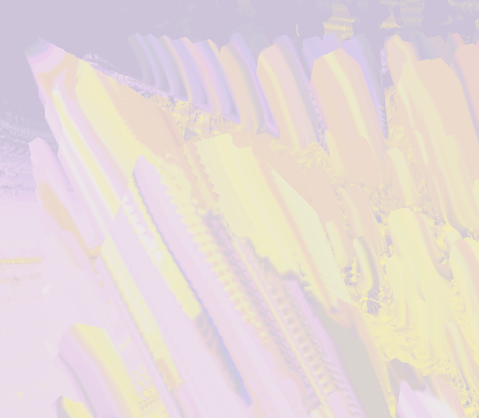

# Datamoshing

Saw someone do a datamoshing shader and had to try one myself. Basically just move pixels around based on motion vectors and dont clear the screen.

Some settings to play around with:

- press 1: resets camera back to origin
- press 2: clears screen
- press 3: disables camera also contributing to motion vectors
- press 4: enables / disables random colors on the objects
- press 5: disables / enables alpha on base texture, default is false and it looks cooler imo

